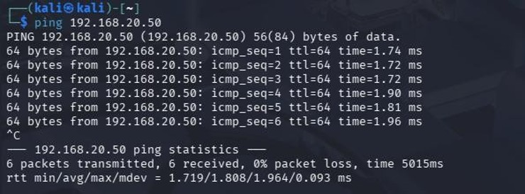

# Reconnaissance and Host Discovery

## Overview

Reconnaissance is the first phase of a penetration test and is used to identify active hosts and gather information about the target environment before further testing.

---

## Objectives

- Identify active hosts on the isolated laboratory network.
- Verify connectivity between the attacker and target systems.
- Perform an initial port scan against the target.
- Record observations for later enumeration and exploitation.

---

## Methodology

The reconnaissance phase was conducted from the Kali Linux attacker machine using industry-standard network discovery tools.

The following activities were performed:

1. Host discovery using `netdiscover`
2. Connectivity verification using `ping`
3. Initial port scanning using `Nmap`

---

## Host Discovery

The `netdiscover` utility was used to identify active hosts on the isolated `192.168.20.0/24` network.

Command used:

```bash
netdiscover -r 192.168.20.0/24


---

# Step 4: Ping Verification

Your report includes a successful ping before the Nmap scan.

Add:

```markdown
## Connectivity Verification

ICMP echo requests were sent from the Kali Linux attacker machine to verify connectivity with the target before beginning service enumeration.



## Initial Port Scan

An initial Nmap scan was performed against the target server to identify accessible services before further assessment.


## Findings

The reconnaissance phase confirmed that:

- The target host was active.
- Communication within the isolated network was functioning correctly.
- Initial service discovery established a baseline before further testing.

## Lessons Learned

- Reconnaissance provides valuable information before exploitation begins.
- Host discovery confirms that target systems are reachable.
- Initial port scanning establishes a baseline for subsequent enumeration.
- Working within an isolated laboratory ensures testing remains safe and controlled.
