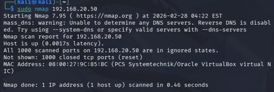
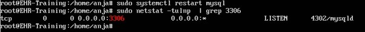
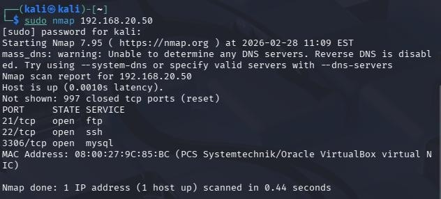
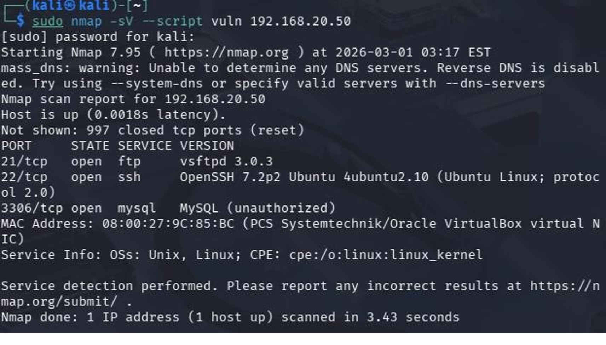

# Service Enumeration and Vulnerability Assessment

## Overview

After confirming that the target host was reachable, service enumeration was performed to identify running services, open ports, operating system information, and potential security weaknesses. This information was then used to assess the attack surface of the target environment.

---

## Objectives

- Identify open network ports.
- Detect running services.
- Determine service versions.
- Perform operating system detection.
- Assess services for potential vulnerabilities.

---

## Initial Enumeration

An initial Nmap scan was performed against the Ubuntu EHR Training Server.

Command used:

```bash
nmap 192.168.20.50
```

The initial scan indicated that no required services were available for further penetration testing.



---

## Service Configuration

To prepare the laboratory for penetration testing, the following services were installed and configured on the Ubuntu server:

- OpenSSH Server
- vsftpd (FTP)
- MySQL Server

The firewall was disabled within the isolated laboratory environment to allow service enumeration.



---

## Service Enumeration

After configuring the server, a second Nmap scan was performed.

Command used:

```bash
nmap -sV -O 192.168.20.50
```

The scan identified:

- FTP (Port 21)
- SSH (Port 22)
- MySQL (Port 3306)

Operating system detection and service version information were successfully collected.



---

## Vulnerability Assessment

Targeted Nmap enumeration scripts were executed against the discovered services.

The assessment confirmed:

- FTP anonymous login disabled.
- SSH supports password and public key authentication.
- MySQL requires authentication.
- No critical vulnerabilities were identified.



---

## Findings

The assessment confirmed that:

- Required services were successfully configured.
- Service versions were identified.
- Authentication mechanisms were functioning correctly.
- No critical vulnerabilities were detected.
- The attack surface was documented for later exploitation exercises.

---

## Lessons Learned

- Enumeration provides detailed information about target systems.
- Version detection helps identify outdated software.
- Nmap scripting is useful for validating service configurations.
- Authentication controls reduce exposure to unauthorized access.
