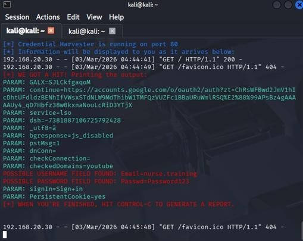

# Social Engineering Assessment

## Overview

This assessment demonstrates how attackers can exploit human behaviour instead of technical vulnerabilities to obtain sensitive information. A phishing simulation was conducted using the Social Engineering Toolkit (SET) within the isolated penetration testing laboratory.

---

## Objectives

- Demonstrate a phishing attack in a controlled environment.
- Simulate credential harvesting using a fake login page.
- Capture test credentials entered by a simulated user.
- Highlight the risks of social engineering attacks.

---

## Methodology

The Social Engineering Toolkit (SET) was used on the Kali Linux attacker machine to create a credential harvesting attack.

The following activities were performed:

1. Launch the Social Engineering Toolkit.
2. Select the Credential Harvester Attack.
3. Generate a phishing login page.
4. Host the phishing page on the Kali Linux machine.
5. Access the page from the Windows 7 workstation.
6. Enter test credentials.
7. Verify that the credentials were captured successfully.

---

## Launching the Social Engineering Toolkit

The Social Engineering Toolkit (SET) was launched on the Kali Linux attacker machine to create the phishing simulation.

Command used:

```bash
sudo setoolkit
```


---

## Credential Harvesting Demonstration

A phishing login page was generated and hosted within the isolated laboratory environment. The Windows 7 virtual machine was used to simulate a user accessing the malicious page.


---

## Captured Credentials

After the simulated user entered test credentials, the Social Engineering Toolkit successfully captured and displayed them on the Kali Linux attacker machine.



---

## Findings

The assessment demonstrated that:

- Users can be deceived into submitting credentials through phishing pages.
- Social engineering attacks require minimal technical exploitation.
- Credential harvesting can be highly effective when users are unaware of phishing techniques.
- Conducting the exercise within an isolated laboratory ensured that no real systems or users were affected.

---

## Lessons Learned

- Human error remains a significant cybersecurity risk.
- Security awareness training is essential to reduce phishing success.
- Multi-factor authentication helps reduce the impact of compromised credentials.
- Simulated phishing exercises are valuable for improving organisational security awareness.

---

## Ethical Considerations

This phishing simulation was performed exclusively within an isolated laboratory environment using virtual machines and test credentials. No real users, production systems, or external networks were involved.
